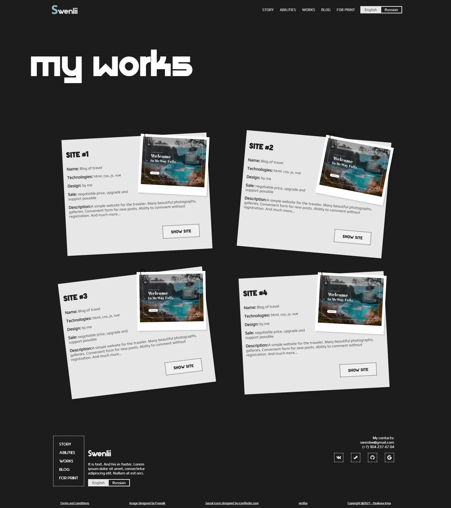

# Портфолио swenlii.
👤 мое личное портфолио

 

## ⚡Описание проекта

**Год разработки**: 2023 год

**Стек**: ● HTML ● CSS ● JS ● ejs ● Node.js ● Express ● JSON

Небольшой личный сайт-портфолио, так же выполняющий функцию резюме. Полная и подробная информация обо мне, в том числе описания моих проектов, подробное описание опыта работы и навыков. Сайт написан на html с использованием ejs. Сервер на node.js & express. Данные для сайта хранятся в JSON и подтягиваются на страницу при помощи ejs.

### 💡 Идея проекта
Дизайн разрабатывался в Miro. Разработка велась 2 недели. На фронте использовались стандартные html, css, js, а файлы разметки ejs расширения. На back используется простейший сервер на node + express и некоторые дополнительные фреймворки, такие как socket.io для обмена сообщениями клиента с сервером или nodemailer для отправки писем. По сути это статичный сайт и БД здесь нет. На данный момент сайт не работает

## 📝 Требования
- npm v8.12.1
- node >= 16.15.1
- Поддерживает все современные браузеры
- Проект запускался на windows с использованием программы visual studio

## 🛠️ Установка

1. `npm install`
2. `npm run start`

## Источники

- Вектор наверху страницы (с компьютером) был найден на сайте [freepik](https://ru.freepik.com) и разработан пользователем [upklyak](https://ru.freepik.com/author/upklyak). 
- В блоке "Мои работы" скрепка была создана мной через программу inkscape. 
- Так же мной создана кнопка в блоке "Мой блог". Иконки соцсетей были найдены на сайтах [uxwing](https://uxwing.com/) и [iconfinder](https://www.iconfinder.com/)
- В качестве основного шрифта используется шрифт ["Play"](https://fonts.google.com/specimen/Play) из [google fonts](https://fonts.google.com). Заголовки: [Baltic Fonts](https://fontesk.com/baltic-fonts/) и [Roboto Slab](https://fonts.google.com/specimen/Roboto+Slab). А вспомогательный шрифт [stark](https://fontstorage.com/ru/font/paulo-r/stark). В контактной форме использован шрифт [Caveat](https://fonts.google.com/specimen/Caveat)
